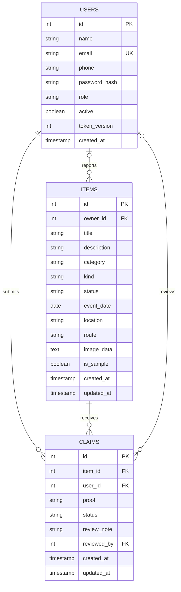

# Implemented PostgreSQL ERD

`items.owner_id` is nullable for seeded records; real reports are assigned the logged-in user. A more precise optionality for sample item ownership is zero-or-one user per item. `claims.reviewed_by` is nullable until review. Claim item/user are required. The database enforces unique email, unique `(item_id,user_id)` and at most one Approved/Returned claim per item. See `db/schema.sql` for exact types, lengths, checks and indexes.
